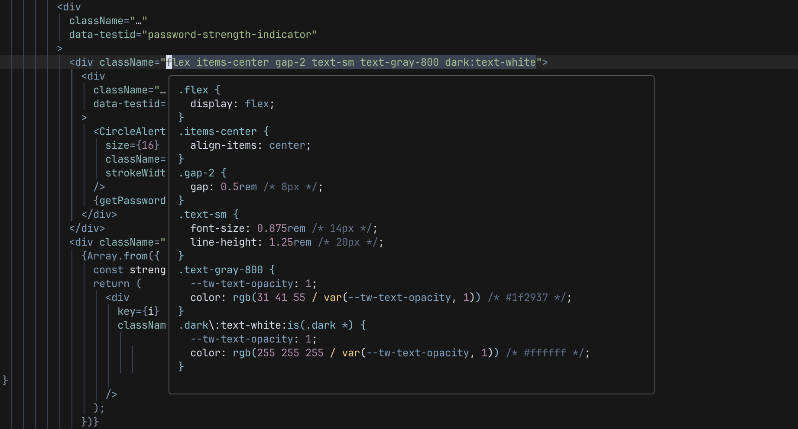

# tailwind-hover.nvim

Shows consolidated Tailwind CSS styles applied to the element under the cursor.



## Usage

It behaves just like the default `lsp.hover` feature.

Choose your preferred shortcut to issue the command `TailwindHover`. Our choice is `<leader>K`, but it's not set by default, it needs your configuration.

Press the shortcut on any `class` (or `className`) attribute containing Tailwind CSS classes and it will open the LSP floating window with the list of all TW classes and their corresponding CSS statements. Any classes unknown to TW will be listed last.

Press the shortcut again, while the floating preview window is open, and it will focus it (just like the default `K` behavior).

## Installation

### Lazy

```lua
{
    "ruicsh/tailwind-hover.nvim",
    keys = {
        { "<leader><s-k>", "<cmd>TailwindHover<cr>", desc = "Tailwind: Hover" },
    },
    opts = {},
    dependencies = {
        "nvim-treesitter/nvim-treesitter",
    },
}
```

## Supported languages

The currently supported languages are the following:

- typescriptreact
- typescript
- astro
- vue
- svelte
- templ
- html

Uses HTML parser as fallback.
